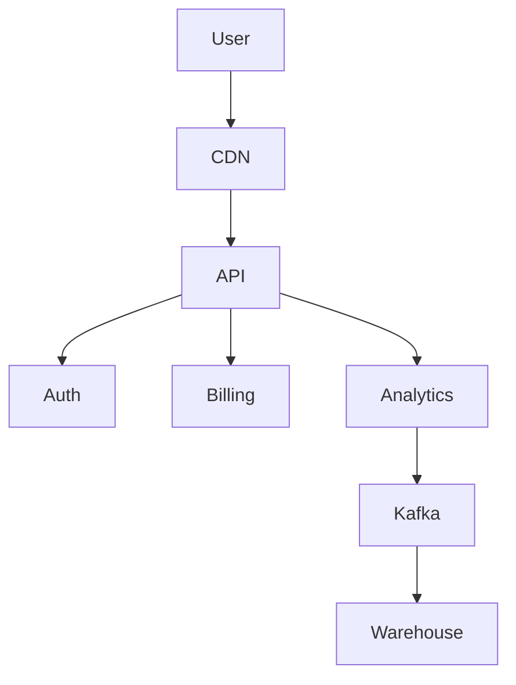

# Multi Tenant Architecture

Multi tenancy allows multiple customers to share the same system.

## Models

### Shared Database Shared Schema

Tenant data separated using tenant ID.

### Shared Database Separate Schema

Each tenant has its own schema.

### Separate Database

Each tenant gets a dedicated database.

## Tradeoffs

Shared DB

Lower cost
Higher complexity

Separate DB

Better isolation
Higher cost

# SaaS Architecture Diagram

