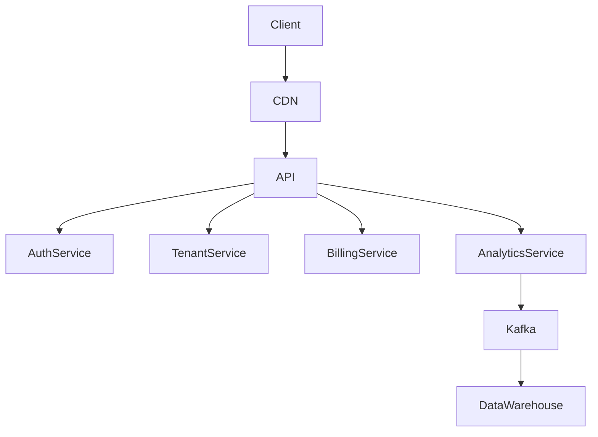

# SaaS Platform System Design

## Problem Statement

Design a multi-tenant SaaS analytics platform used by financial institutions.

## Functional Requirements

* User authentication
* Tenant onboarding
* Dashboard analytics
* Report generation
* Subscription billing
* API integrations

## Non Functional Requirements

* 99.9% availability
* tenant isolation
* scalability
* security compliance

## Architecture

## Key Components

| Service           | Responsibility       |
| ----------------- | -------------------- |
| Auth Service      | Authentication       |
| Tenant Service    | Tenant management    |
| Billing Service   | Subscription billing |
| Analytics Service | Data processing      |

## Scaling Strategy

* Stateless APIs
* Horizontal scaling
* Redis caching
* Kafka event streaming
