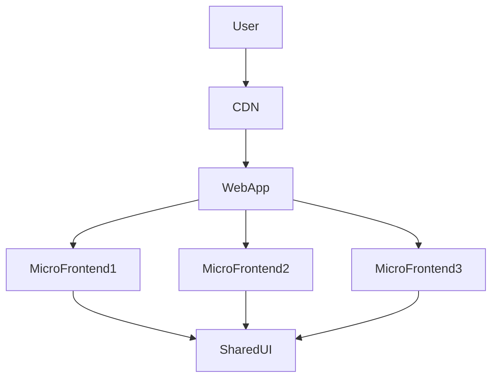

# Enterprise Frontend Architecture

## Problem

Design a scalable frontend architecture for enterprise banking applications.

## Requirements

* modular architecture
* independent team deployments
* reusable components
* high performance

## Architecture

## Key Concepts

### Microfrontends

Allows multiple teams to build and deploy independent frontend modules.

### Shared Design System

Reusable UI components across applications.

### Performance Optimizations

* lazy loading
* code splitting
* CDN caching
